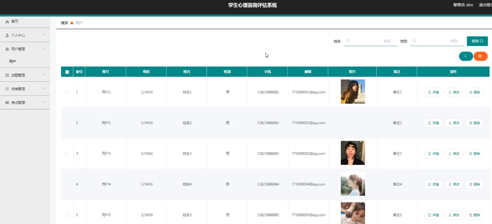
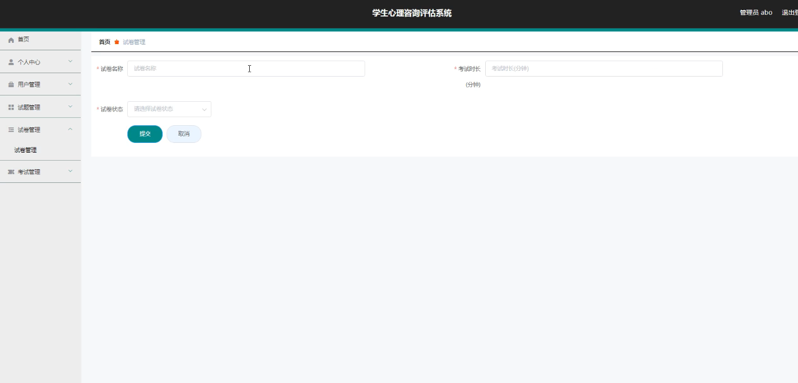
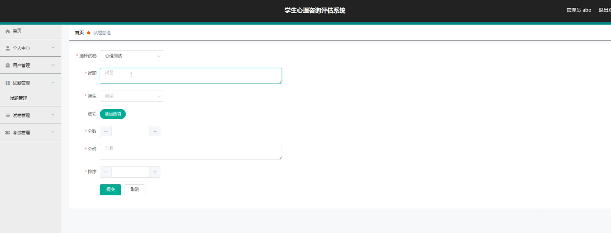
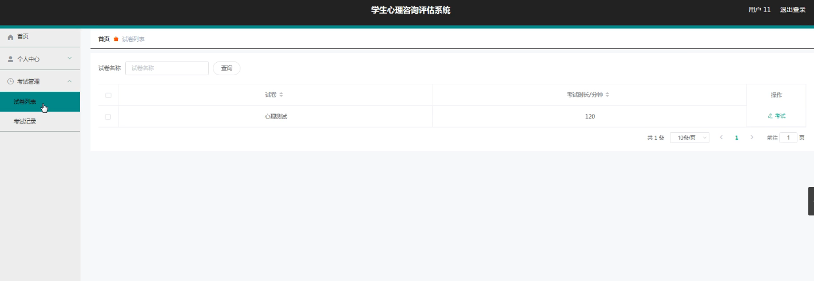
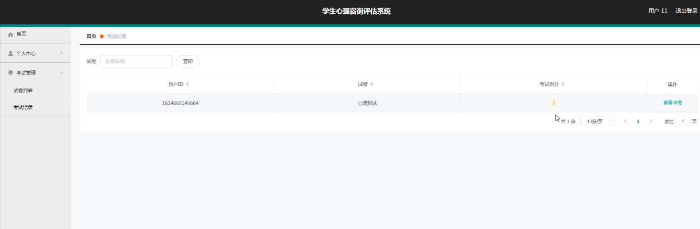

**项目简介：**  
本项目基于主流的前后端分离架构，采用 **SpringBoot + Vue 技术栈**，配套 **MySQL 数据库**，适用于毕业设计与课题实训开发。  
本人已整理了超 **4000 多套毕业设计源码+论文+开题报告+PPT...**，涵盖 **Java、SpringBoot、Vue、SSM、uni-app 小程序、PHP、Android** 等方向，支持功能修改定制与论文服务。  
**团队提供以下服务：**  
- 项目代码修改与调试  
- 数据库配置与远程协助  
- 论文定制与修改  
**获取更多的4000多套源码或SQL文件请联系：**  
- QQ：3906443360 微信：BesheHelp

## springboot005学生心理咨询评估系统

**项目简介：**  
本项目基于主流的前后端分离架构，采用 **SpringBoot + Vue 技术栈**，配套 **MySQL 数据库**，适用于毕业设计与课题实训开发。  
本人已整理了超 **4000 多套毕业设计源码+论文+开题报告+PPT...**，涵盖 **Java、SpringBoot、Vue、SSM、uni-app 小程序、PHP、Android** 等方向，支持功能修改定制与论文服务。  
**团队提供以下服务：**  
- 项目代码修改与调试  
- 数据库配置与远程协助  
- 论文定制与修改  
**获取更多的4000多套源码或SQL文件请联系：**  
- QQ：3906443360 微信：BesheHelp**

# 系统实现与系统测试

# 5 系统实现

5.1用户信息管理

管理员管理用户信息，可以添加，修改，删除用户信息信息。下图就是用户信息管理页面。

图5.1 用户信息管理页面

5.2 试卷信息管理

管理员管理试卷信息，可以添加，修改，删除试卷信息信息。下图就是试卷信息管理页面。

图5.2试卷信息管理页面

5.3 试题信息管理

管理员管理试题信息，可以添加，修改，删除试题信息信息。下图就是试题信息管理页面。

图5.3 试题信息管理页面

5.4试卷列表管理

用户登录后可以在试卷列表找到试卷参考考试。下图就是试卷列表管理页面。

图5.4 试卷列表管理页面

5.5考试记录管理

用户可以查看自己的考试记录。下图就是考试记录管理页面。

图5.5 考试记录管理页面

